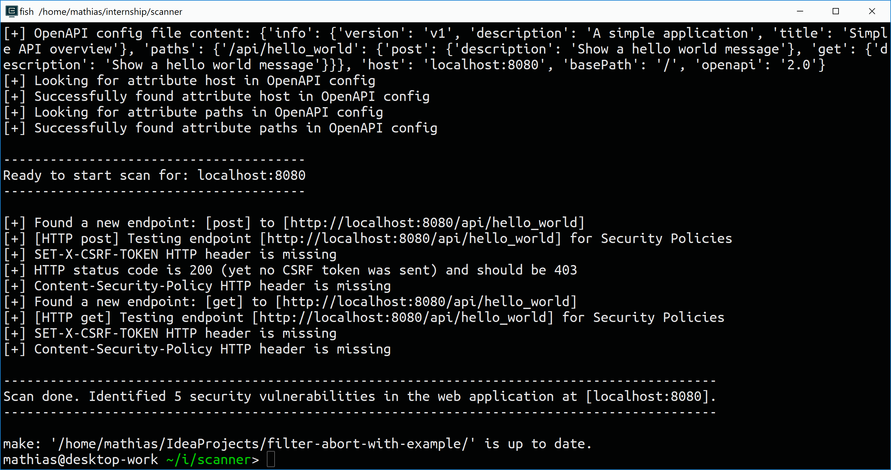
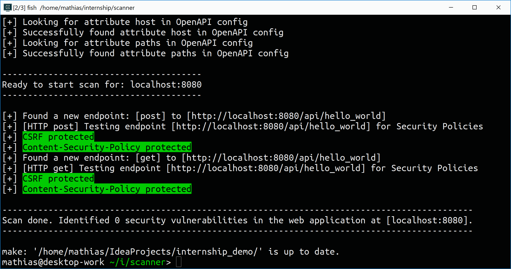

# Web vulnerability scanner for SeCloud

See the tool in action [here](https://vimeo.com/259124091).

## Installation
```
make install
```

## Run
```
make run ~/web/project/to/scan
```

## Screenshots




